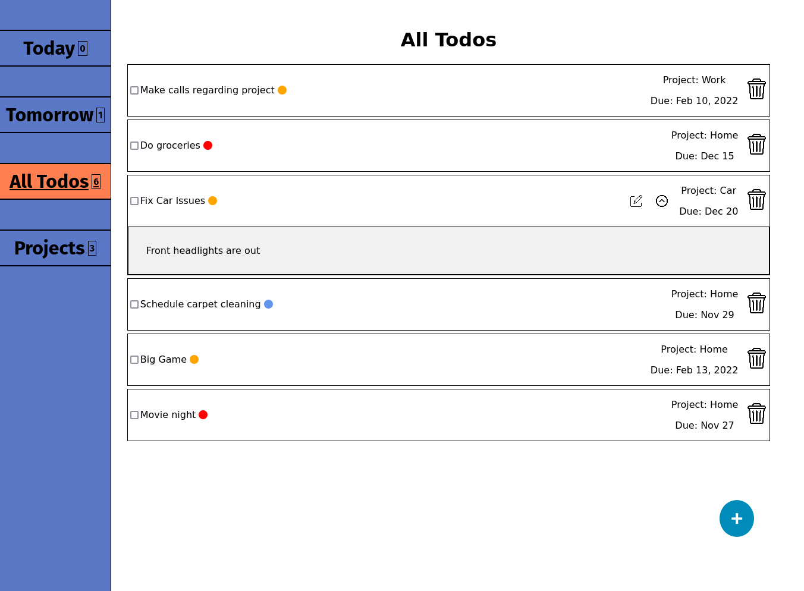
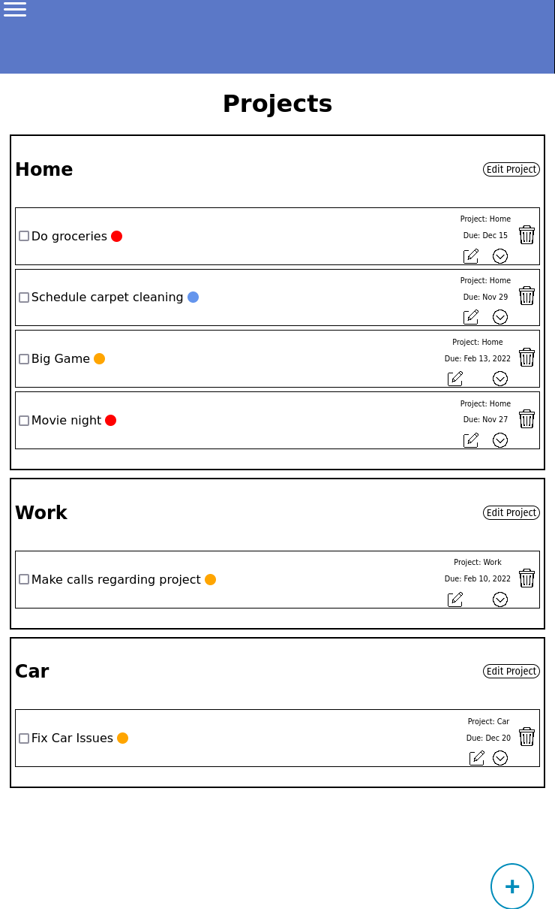

# todo-list

Desktop             |  Mobile
:-------------------------:|:-------------------------:
  |  

[Live Page](https://sebastienpj.github.io/todo-list/)

A web app that allows you to organize your day into projects and tasks and greatly increase productivity.

Topics learned/reinforced:
- Object Oriented Programming Principles
- Node Package Manager
  -  Downloading, importing libraries (date-nfs)
- Webpack
- ES6 Modules
    - Importing and Exporting modules
- Saving to localStorage